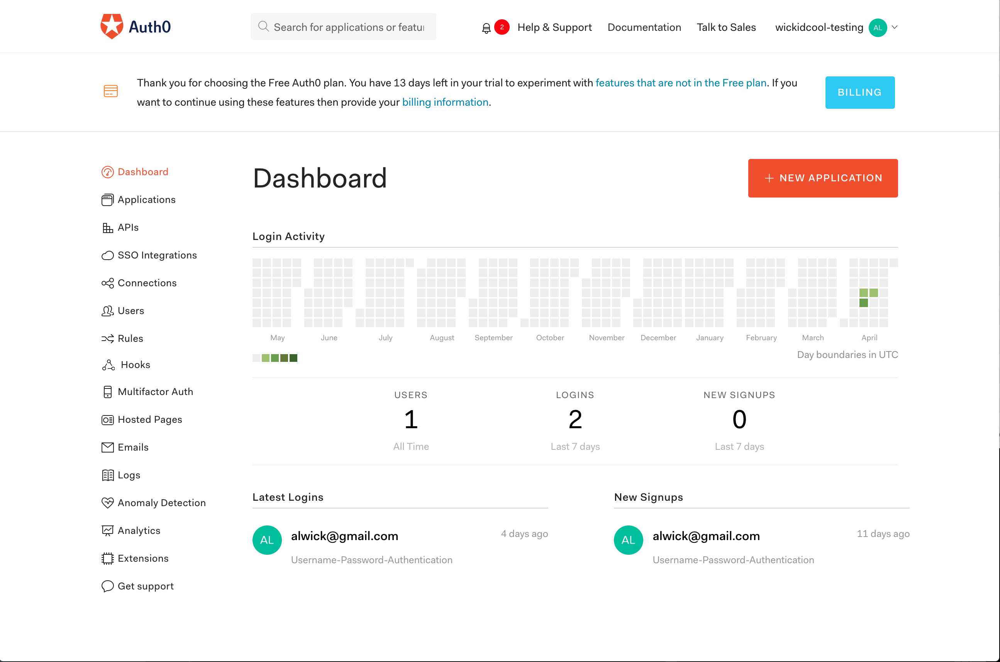
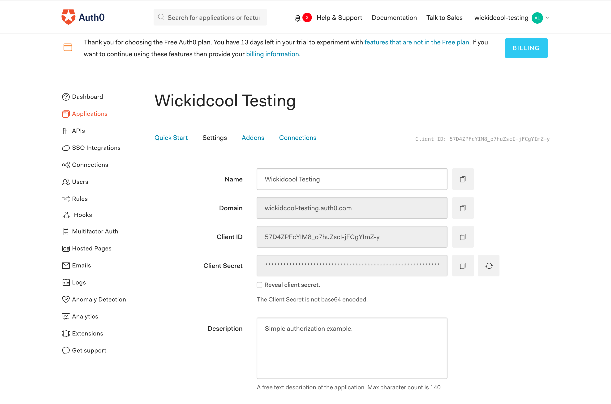
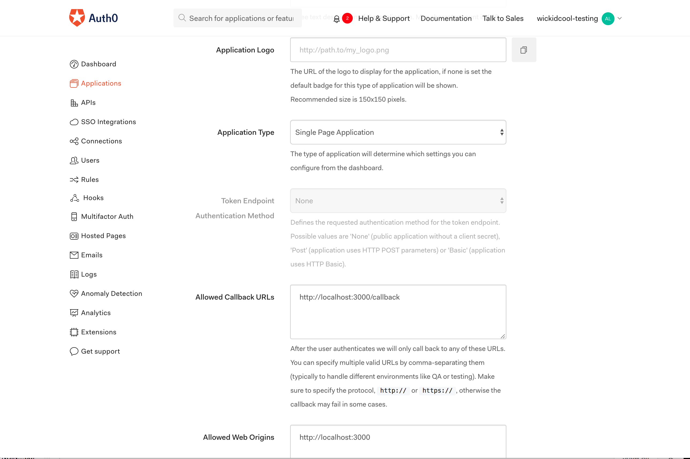
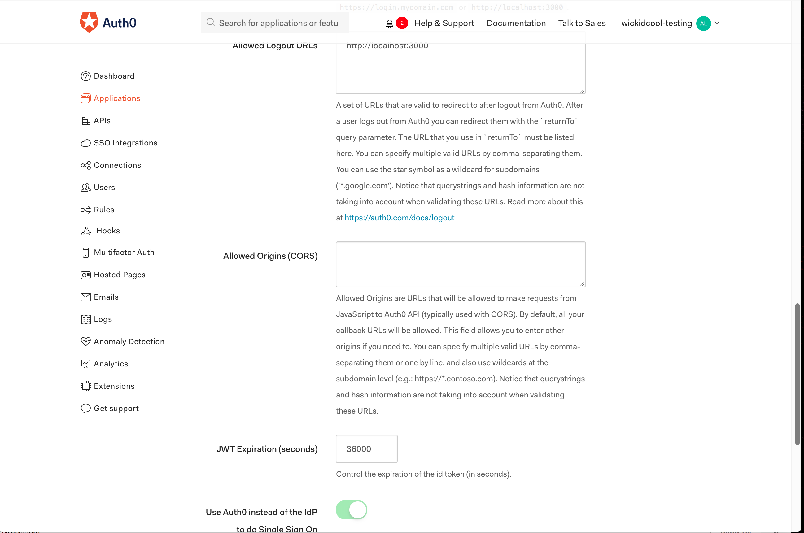
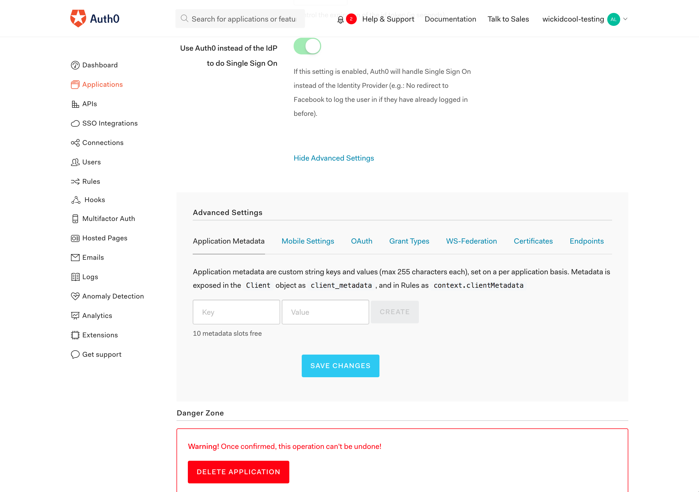
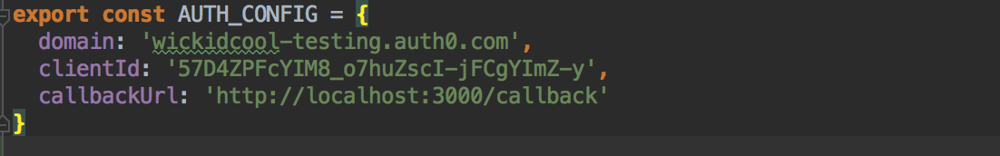

# Auth0 Reactjs Example

**NOTE:** This project was bootstrapped with [Create React App](https://github.com/facebookincubator/create-react-app).

## Features
Login and JWT token access from [Auth0](http://auth0.com) tenant all client side

**NOTE** Doesn't validate the JWT token other than it is still active

## Setup
1. You will need to create an [Auth0](http://auth0.com) account as well as a tenant that you can used for authenticating against.


2. Configure the application in Auth0.
Enter the name and description for the applicagtion.


Enter the valid URLs for callback and logout




Advanced options - we will not cover these in this example.


3. Update the project with your tenant's values (src/components/Auth/auth0-variables.js).


## Usage

To install npm modules
```
npm run install
```

Starting the server
```bash
npm run start
```